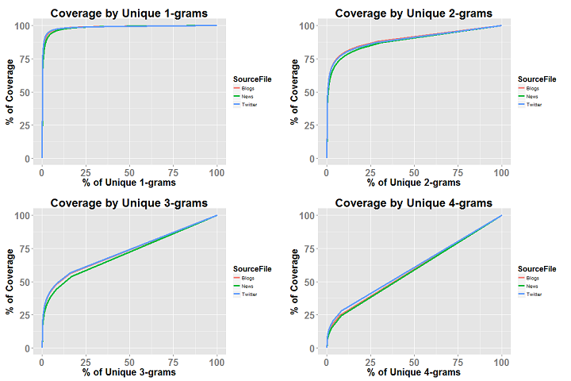
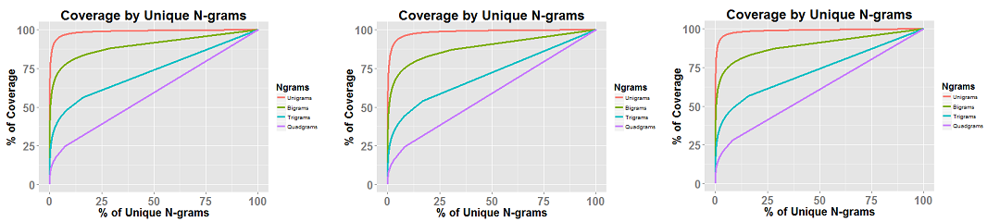

### Introduction

This milestone report introduces some key findings regarding the Switfkey's Word Predictor project as proposed by the Data Science Specialization team at Johns Hopkins University. The project draws on Natural Language Processing (NLP) techniques in order to predict the most likely next word as the user enters some text.
A corpora of texts from several blogs, news feeds and tweets was made available as a training set for this project. In order to use this data, it is necessary to preprocess the raw data and perform some initial statistical analysis in order to discover the main characteristics of the corpora.

### Preprocess

The preprocessing step includes the cleaning and tokenization of the datasets, as well as the separation of sentences. The following issues were tackled during this step:

- Conversion to lower case
- Removal of numbers and special characters (%, $, ^ and so on), except for the apostrophe which was kept in order to allow for the use of common contractions in English
- Separation of sentences by substitution of punctuation (.?!) for end-of-sentence tags immediately followed by begin-of-sentence tags so no cross-sentence N-grams are generated
- Tokenization

The issue of profanity words will be dealt with at prediction level by filtering out possible results classified as profanity words.
After cleaning and tokenizing, the resulting datasets was used to generate 1, 2, 3 and 4-grams and their respective frequencies in each of the sources (blogs, news, tweets).

### Basic Statistics/Visualization

```{r echo=FALSE}
  setwd("D:/Downloads/Coursera/Data Science Capstone/Milestone Final")
  load('milestone_stats.RData')
  source.stats = format(source.stats,digits=2,nsmall=0,scientific=FALSE,big.mark=",")
  cov.points = format(cov.points,digits=2,nsmall=2)
```

The second step is to perform a statistical analysis of the preprocessed datasets. The following table contains some basic statistics by source.

#### Statistics by Source
Stat | Blogs | News | Twitter
-----|-------|------|--------
Lines | `r source.stats['Lines',1]` | `r source.stats['Lines',2]` | `r source.stats['Lines',3]`
Non-empty Lines | `r source.stats['LinesNEmpty',1]` | `r source.stats['LinesNEmpty',2]` | `r source.stats['LinesNEmpty',3]`
Chars | `r source.stats['Chars',1]` | `r source.stats['Chars',2]` | `r source.stats['Chars',3]`
Non-white Chars | `r source.stats['CharsNWhite',1]` | `r source.stats['CharsNWhite',2]` | `r source.stats['CharsNWhite',3]`
Average Chars per Line | `r source.stats['AvgCharsLine',1]` | `r source.stats['AvgCharsLine',2]` | `r source.stats['AvgCharsLine',3]`
Words | `r source.stats['wordcount',1]` | `r source.stats['wordcount',2]` | `r source.stats['wordcount',3]`
Average Words per Line | `r source.stats['WordsLine',1]` | `r source.stats['WordsLine',2]` | `r source.stats['WordsLine',3]`
Unique Words | `r source.stats['UniqueWords',1]` | `r source.stats['UniqueWords',2]` | `r source.stats['UniqueWords',3]`

It is clear to see that the Twitter dataset is twice as large as the other two when it comes to the number of entries. However, the Twitter entries are approximately one third of the size of the other two. 
It is also important to notice that there are more unique words in the Twitter dataset.

#### Distributions - # Chars and # Words per Post/News/Tweet

The following graphs depict the distribution of characters (on the left) and words (on the right) per entry for each of the sources (blogs, news and Twitter).


The blog posts have a skewed distribution corresponding to short messages with few words. On the other hand, news feeds have a less skewed distribution, with lenghtier messages containing more words. The Twitter dataset is different since no tweets are allowed to have more than 140 characters by definition. The oddly shaped distribution of words is probably the result of the heavy use of abbreviations and expressions by the users to comply with the character limit.

#### Coverage by Ngram

The following graphs and table present the text coverage given by the proportion of unique words used. Since the total number of possible combinations increases with N-gram size, the relative frequency of any single combination decreases and so does the coverage.



Coverage | Unigrams | Bigrams | Trigrams | Quadgrams
---------|----------|---------|----------|----------
50% | `r cov.points['50%',1]`% | `r format(cov.points['50%',2],digits=2)`% | `r cov.points['50%',3]`% | `r cov.points['50%',4]`%
80% | `r cov.points['80%',1]`% | `r format(cov.points['80%',2],digits=2)`% | `r cov.points['80%',3]`% | `r cov.points['80%',4]`%
90% | `r cov.points['90%',1]`% | `r format(cov.points['90%',2],digits=2)`% | `r cov.points['90%',3]`% | `r cov.points['90%',4]`%
95% | `r cov.points['95%',1]`% | `r format(cov.points['95%',2],digits=2)`% | `r cov.points['95%',3]`% | `r cov.points['95%',4]`%
99% | `r cov.points['99%',1]`% | `r format(cov.points['99%',2],digits=2)`% | `r cov.points['99%',3]`% | `r cov.points['99%',4]`%

For unigrams, only 1.40% of the total unique words are needed to cover 90% of the text, while for quadgrams, almost an equal size of the total combinations are needed.
So, there is no reason to use N-grams of size larger than 4 as they would get closer and closer to a straight line in the graphs, thus providing less and less predictive power.

#### Coverage by Source - Blogs, News, Twitter

The following three graphs show the coverage of the N-grams by source, respectively, Blogs, News and Twitter. It is clear the substantial reduction of the coverage as the N-gram size increases, as stated previously.



### Word Clouds

The word clouds below provide an intuitive view of the distribution of the N-grams 1 through 4 for ach different source.
It is interesting to notice the difference between Twitter clouds and the other two. As unigrams are concerned, the word ***you*** appears more frequently and as tri- and quadgrams are concerned, the particular combination of words ***thanks for the*** and ***thanks for the follow*** are typical of the Twitter environment.

#### Blogs - Word Clouds


#### News - Word Clouds


#### Twitter - Word Clouds


### Algorithm / Application

The main goal of this project is to develop and deploy an online application that takes as input a phrase (multiple words) in a text box input and outputs a prediction of the next word. The application is required to be small enough to load onto the Shiny Server. Moreover, it should perform well as it is intended to be a mobile app.

In order to achieve those goals, the model to be implemented will rely on N-grams of size 1 through 4 and use a simple back-off strategy to allow for unobserved combinations of words.
First, rare combinations (i.e. observed only once in a dataset) will be discarded. Then the N-gram frequencies calculated for each dataset (blogs, news and Twitter) will be averaged to obtain the final table of frequencies. This strategy was considered in order to take into account the very different characteristics of the datasets which would be diluted had the frequency tables been calculated over an aggregated set of texts.

Finally, only the top 5 most likely words following the nearest 1 to 3-gram typed as input will be returned as a suggestion to the user.