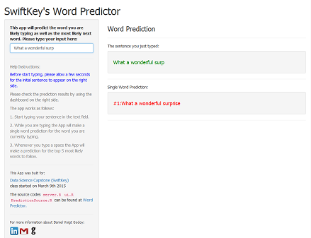
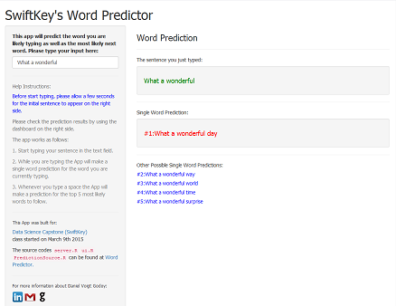

## Introducing the Word Predictor App

The Swiftkey's Word Predictor App was developed upon a Corpora of texts from several blogs, news feeds and tweets made available as a training set for this project and it draws on Natural Language Processing (NLP) techniques in order to predict the most likely next word as the user enters some text.

The App was supposed to take a phrase as input and to generate a prediction of the next word. Also, it was required to be small enough to be loaded onto the Shiny Server and to perform well as it was intended to be a mobile App.

The developed App accomplished those goals and more! Not only it makes a prediction for the next word but it also predicts the word you are likely typing before you finish it! Moreover, it is fully automatic (***no*** button clicking required!) and its predictions are lightning-fast delivered to you.

---

## Features

When you start typing a sentence in the text input on the left side, the Swiftkey's Word Predictor starts working in a fully automatic way making two types of word prediction:

1. as you type, it makes a prediction for the word you are most likely typing
2. whenever you type a space, it makes a prediction for the most likely word to follow and it also suggests four other possible words

Current Word Prediction (1) | Next Word Prediction (2)
----------------------------|-------------------------
 | 

---

## Algorithm

The App relies on N-grams of size 1 through 4 and uses a simples back-off strategy to allow for unobserved combinations of words:

- First, rare combinations (i.e. observed only once in a dataset) were discarded.
- Then the N-gram frequencies calculated for each dataset (blogs, news and Twitter) were averaged to obtain the final table of frequencies. This strategy was developed in order to take into account the very different characteristics of the datasets which would be diluted had the frequency tables been calculated over an aggregated set of texts. 
- Based on those frequencies, only the top 5 most likely words following the nearest 1 to 3-gram typed as input are returned as a suggestion to the user. And, for the prediction of the word being typed, the App returns the unigram containing the partially-typed word at its beginning with the highest frequency.
- According to the benchmark provided by Jan Hagelauer and available at https://github.com/jan-san/dsci-benchmark, the App achieved an Overall top-3 score of ***21.35%*** while using ***157.44 MB*** of memory and performed with an average runtime of only ***0.53 msec***!

---

## Try it yourself!

Try the Swiftkey's Word Predictor App yourself:

1. Go to https://dvgodoy.shinyapps.io/WordPredictor/
2. In a couple seconds, the App will load and the sentence "What a wondeful"" will appear in green on the right side.
3. Start typing! It is simple as that!
4. Have fun with it! Start with 2 or 3 words of your own and go along with the word predictions - you will be surprised by the results!
